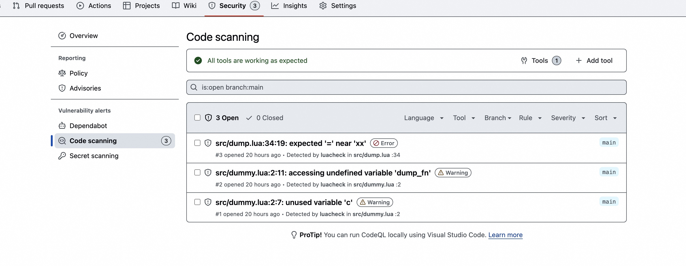
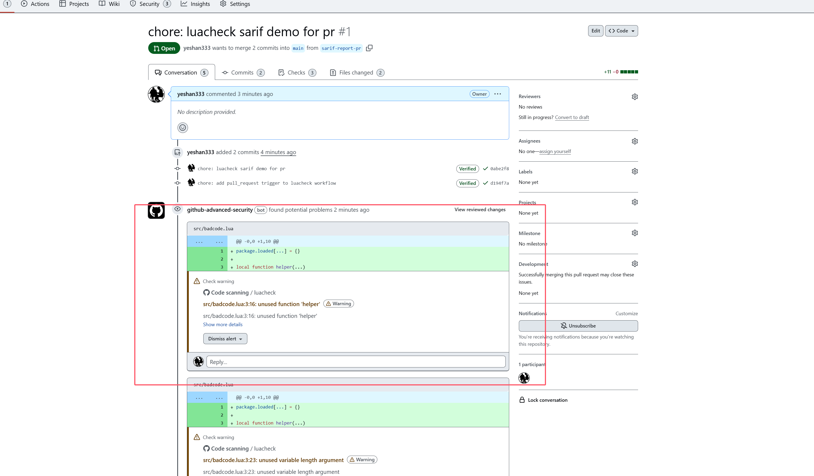

# luacheck_sarif_report_demo

> 【Demo】 Integrating GitHub Code scanning with luacheck Sarif formatter.

workflow ref: [.github/workflows/luacheck.yaml/](.github/workflows/luacheck.yaml)

## View the report

- [https://github.com/yeshan333/luacheck_sarif_report_demo/security/code-scanning](https://github.com/yeshan333/luacheck_sarif_report_demo/security/code-scanning)

[Pull Request](https://github.com/yeshan333/luacheck_sarif_report_demo/pull/1)

## References

- [SARIF support for code scanning](https://docs.github.com/en/code-security/code-scanning/integrating-with-code-scanning/sarif-support-for-code-scanning)
- [Uploading a SARIF file to GitHub](https://docs.github.com/en/code-security/code-scanning/integrating-with-code-scanning/uploading-a-sarif-file-to-github)